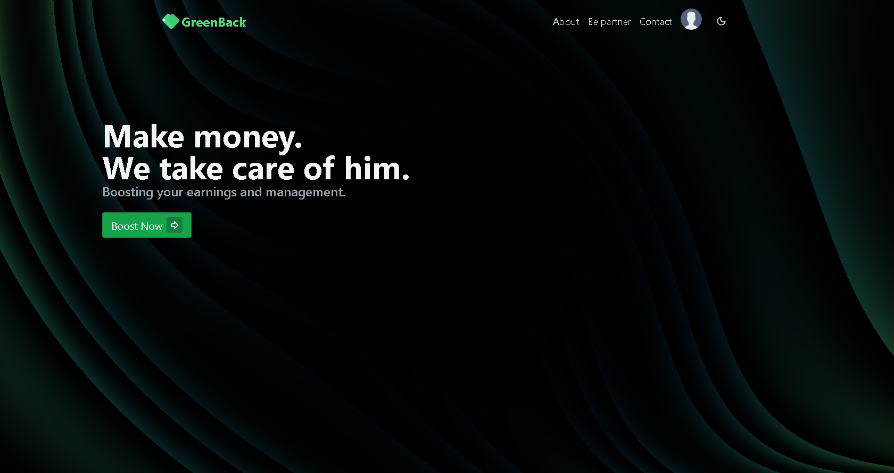
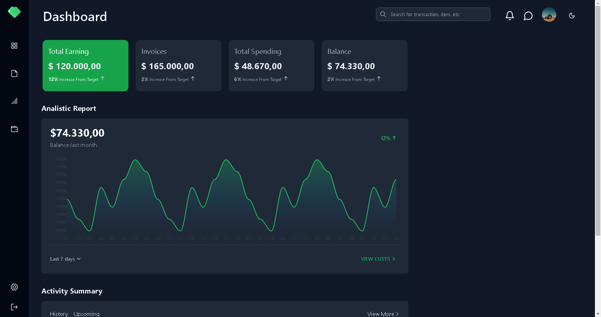
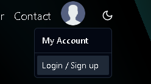
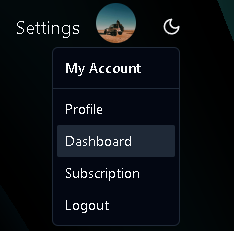
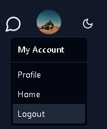

# Greenback

Este é um projeto de um sistema para gerenciamento de finanças, que está apenas em seu início. Possui apenas a parte inicial do frontend, sera desenvolvido ainda o backend contando com uma API Rest e um banco de dados SQL.


## Visão Geral

Este projeto tem como objetivo ser um sistema de finanças completo.





## Instalação

Para executar este projeto localmente, siga estas etapas:

1. Clone o repositório para o seu ambiente local:

    ```
    git clone https://github.com/kauamntro/Greenback.git
    ```

2. Instale as dependências do projeto:

    ```
    npm install
    ```

3. Ir pasta principal:

    ```
    cd greenback_front
    ```

4. Execute o projeto:

    ```
    npm run dev
    ```

Se quiser ir para o dashboard basta seguir os passos:

<div style="display: flex; gap: 1rem; flex-direction: row; align-items:center;">


</div>

E pra sair:



## Contribuição

Se você quiser contribuir com este projeto, siga me nas redes sociais:

. [Instagram](https://www.instagram.com/code.kaua/)
. [linkedin](linkedin.com/in/kauamntro/)

## Licença

Este projeto está licenciado sob a [MIT](https://pt.wikipedia.org/wiki/Licen%C3%A7a_MIT).

## Contato

Se você tiver alguma dúvida ou sugestão sobre este projeto, entre em contato através de meu perfil no [linkedin](linkedin.com/in/kauamntro/)
